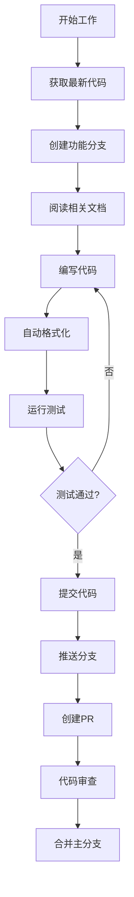

# 力通电子网站开发指导手册

> 🚀 **高效开发工作流指南**  
> 📖 **文档自动化和代码质量保证**  
> 🔧 **智能工具链和最佳实践**

---

## 📚 目录

1. [快速开始](#-快速开始)
2. [文档导航系统](#-文档导航系统)
3. [开发环境配置](#️-开发环境配置)
4. [代码自动补全](#-代码自动补全)
5. [自动化改进工具](#-自动化改进工具)
6. [代码检查和修复](#-代码检查和修复)
7. [自动化测试](#-自动化测试)
8. [文档自动生成](#-文档自动生成)
9. [工作流程](#-工作流程)
10. [故障排查](#-故障排查)

---

## 🚀 快速开始

### 环境要求

```bash
# 系统要求
Node.js >= 18.0.0
npm >= 9.0.0
Git >= 2.30.0

# 推荐工具
VS Code + 扩展包
Chrome DevTools
Figma Desktop App
```

### 一键启动脚本

```bash
# 克隆项目
git clone https://github.com/your-org/litong-website.git
cd litong-website

# 运行开发环境配置脚本
npm run setup:dev

# 启动开发服务器
npm run dev
```

### 核心命令速查

```bash
# 开发相关
npm run dev              # 启动开发服务器
npm run build           # 生产构建
npm run start           # 启动生产服务器

# 代码质量
npm run lint            # ESLint检查
npm run lint:fix        # 自动修复ESLint问题
npm run format          # Prettier格式化
npm run typecheck       # TypeScript类型检查

# 测试相关
npm run test            # 运行所有测试
npm run test:watch      # 监听模式测试
npm run test:coverage   # 生成覆盖率报告
npm run test:e2e        # 端到端测试

# 文档生成
npm run docs:generate   # 生成API文档
npm run storybook       # 启动组件文档
npm run docs:build      # 构建文档站点
```

---

## 📖 文档导航系统

### 文档结构概览

```
docs/
├── 01-项目概览.md                    # 🎯 项目基本信息
├── 02-网站架构设计.md                # 🏗️ 技术架构和URL设计
├── 03-页面设计规范.md                # 🎨 页面布局和HTML结构
├── 04-CMS数据模型设计.md             # 📊 Sanity数据模型
├── 05-SEO优化策略.md                 # 🔍 SEO实施策略
├── 06-用户交互功能设计.md             # 🖱️ 交互功能规范
├── 07-视觉设计系统.md                # 🎨 设计系统和组件
├── 08-技术实现规范.md                # ⚙️ 技术实施标准
├── 09-多语言国际化.md                # 🌍 i18n实施方案
├── 10-部署运维方案.md                # 🚀 部署和运维
├── 11-安全隐私规范.md                # 🔒 安全和隐私
├── 12-错误处理与异常管理.md          # ⚠️ 错误处理策略
├── 13-测试策略与质量保证.md          # 🧪 测试策略
├── 14-性能优化策略.md                # ⚡ 性能优化
├── 15-内容管理与编辑工作流.md        # ✏️ 内容管理
├── 16-业务智能与数据分析.md          # 📈 数据分析
├── 17-无障碍访问与用户体验.md        # ♿ 无障碍和UX
├── 18-API设计与集成规范.md           # 🔌 API设计
├── 19-数据迁移与导入策略.md          # 📦 数据迁移
└── README.md                         # 📋 文档总览
```

### 智能文档导航脚本

创建 `scripts/nav-docs.js`:

```javascript
#!/usr/bin/env node

const fs = require('fs');
const path = require('path');
const readline = require('readline');

// 文档映射
const docMap = {
  '架构': ['02-网站架构设计.md', '08-技术实现规范.md'],
  '设计': ['03-页面设计规范.md', '07-视觉设计系统.md'],
  '数据': ['04-CMS数据模型设计.md', '19-数据迁移与导入策略.md'],
  'SEO': ['05-SEO优化策略.md'],
  '交互': ['06-用户交互功能设计.md', '17-无障碍访问与用户体验.md'],
  '国际化': ['09-多语言国际化.md'],
  '部署': ['10-部署运维方案.md'],
  '安全': ['11-安全隐私规范.md'],
  '测试': ['13-测试策略与质量保证.md'],
  '性能': ['14-性能优化策略.md'],
  '内容': ['15-内容管理与编辑工作流.md'],
  '分析': ['16-业务智能与数据分析.md'],
  'API': ['18-API设计与集成规范.md']
};

// 交互式文档导航
async function navigateDocs() {
  const rl = readline.createInterface({
    input: process.stdin,
    output: process.stdout
  });

  console.log('📖 力通电子网站文档导航');
  console.log('请选择要查看的文档类型：\n');
  
  Object.keys(docMap).forEach((key, index) => {
    console.log(`${index + 1}. ${key}`);
  });

  rl.question('\n请输入数字或关键词：', (answer) => {
    const key = Object.keys(docMap)[parseInt(answer) - 1] || answer;
    const docs = docMap[key];
    
    if (docs) {
      console.log(`\n📄 ${key}相关文档：`);
      docs.forEach(doc => {
        console.log(`   - docs/${doc}`);
      });
    } else {
      console.log('未找到相关文档');
    }
    
    rl.close();
  });
}

if (require.main === module) {
  navigateDocs();
}

module.exports = { docMap, navigateDocs };
```

### 快速文档查找命令

在 `package.json` 中添加：

```json
{
  "scripts": {
    "docs:nav": "node scripts/nav-docs.js",
    "docs:search": "grep -r --include='*.md' -n -i",
    "docs:tree": "tree docs/ -I 'node_modules'",
    "docs:serve": "http-server docs/ -p 8080 -o"
  }
}
```

使用示例：
```bash
# 交互式导航
npm run docs:nav

# 搜索文档内容
npm run docs:search "GraphQL"

# 查看文档树结构
npm run docs:tree

# 启动文档服务器
npm run docs:serve
```

---

## ⚙️ 开发环境配置

### VS Code 工作区配置

创建 `.vscode/settings.json`:

```json
{
  "editor.defaultFormatter": "esbenp.prettier-vscode",
  "editor.formatOnSave": true,
  "editor.codeActionsOnSave": {
    "source.fixAll.eslint": true,
    "source.organizeImports": true
  },
  "typescript.preferences.importModuleSpecifier": "relative",
  "emmet.includeLanguages": {
    "typescript": "html",
    "typescriptreact": "html"
  },
  "files.associations": {
    "*.css": "tailwindcss"
  },
  "tailwindCSS.includeLanguages": {
    "typescript": "html",
    "typescriptreact": "html"
  },
  "typescript.suggest.autoImports": true,
  "typescript.suggest.completeFunctionCalls": true,
  "typescript.suggest.includeAutomaticOptionalChainCompletions": true
}
```

### 推荐的VS Code扩展

创建 `.vscode/extensions.json`:

```json
{
  "recommendations": [
    "esbenp.prettier-vscode",
    "dbaeumer.vscode-eslint",
    "bradlc.vscode-tailwindcss",
    "ms-vscode.vscode-typescript-next",
    "formulahendry.auto-rename-tag",
    "christian-kohler.path-intellisense",
    "ms-vscode.vscode-json",
    "sanity-io.vscode-sanity",
    "GraphQL.vscode-graphql",
    "ms-playwright.playwright",
    "orta.vscode-jest",
    "yoavbls.pretty-ts-errors",
    "usernamehw.errorlens",
    "streetsidesoftware.code-spell-checker"
  ]
}
```

### 开发环境自动配置脚本

创建 `scripts/setup-dev.js`:

```javascript
#!/usr/bin/env node

const fs = require('fs').promises;
const path = require('path');
const { execSync } = require('child_process');

async function setupDev() {
  console.log('🚀 开始配置开发环境...\n');

  try {
    // 1. 安装依赖
    console.log('📦 安装项目依赖...');
    execSync('npm install', { stdio: 'inherit' });

    // 2. 复制环境变量模板
    console.log('⚙️ 配置环境变量...');
    try {
      await fs.access('.env.local');
      console.log('   .env.local 已存在');
    } catch {
      await fs.copyFile('.env.example', '.env.local');
      console.log('   创建 .env.local 文件');
    }

    // 3. 创建必要的目录
    console.log('📁 创建项目目录...');
    const dirs = [
      'src/components',
      'src/lib',
      'src/types',
      'src/hooks',
      'src/utils',
      'public/images',
      'public/icons',
      'tests/__mocks__',
      'docs/api'
    ];

    for (const dir of dirs) {
      try {
        await fs.mkdir(dir, { recursive: true });
        console.log(`   ✓ ${dir}`);
      } catch (error) {
        if (error.code !== 'EEXIST') {
          throw error;
        }
      }
    }

    // 4. 安装Git钩子
    console.log('🪝 配置Git钩子...');
    execSync('npx husky install', { stdio: 'inherit' });

    // 5. 生成类型定义
    console.log('🔍 生成类型定义...');
    execSync('npm run typecheck', { stdio: 'inherit' });

    console.log('\n✅ 开发环境配置完成！');
    console.log('\n🎉 运行以下命令开始开发：');
    console.log('   npm run dev\n');

  } catch (error) {
    console.error('❌ 配置失败:', error.message);
    process.exit(1);
  }
}

if (require.main === module) {
  setupDev();
}

module.exports = setupDev;
```

---

## 🤖 代码自动补全

### TypeScript 智能提示配置

创建 `tsconfig.json`:

```json
{
  "compilerOptions": {
    "lib": ["dom", "dom.iterable", "es6"],
    "allowJs": true,
    "skipLibCheck": true,
    "strict": true,
    "forceConsistentCasingInFileNames": true,
    "noEmit": true,
    "esModuleInterop": true,
    "module": "esnext",
    "moduleResolution": "node",
    "resolveJsonModule": true,
    "isolatedModules": true,
    "jsx": "preserve",
    "incremental": true,
    "plugins": [
      {
        "name": "next"
      }
    ],
    "baseUrl": ".",
    "paths": {
      "@/*": ["./src/*"],
      "@/components/*": ["./src/components/*"],
      "@/lib/*": ["./src/lib/*"],
      "@/types/*": ["./src/types/*"],
      "@/hooks/*": ["./src/hooks/*"],
      "@/utils/*": ["./src/utils/*"],
      "@/styles/*": ["./src/styles/*"]
    }
  },
  "include": ["next-env.d.ts", "**/*.ts", "**/*.tsx", ".next/types/**/*.ts"],
  "exclude": ["node_modules"]
}
```

### 全局类型定义

创建 `src/types/global.d.ts`:

```typescript
// 全局类型定义
declare global {
  namespace NodeJS {
    interface ProcessEnv {
      NEXT_PUBLIC_SANITY_PROJECT_ID: string;
      NEXT_PUBLIC_SANITY_DATASET: string;
      SANITY_API_TOKEN: string;
      NEXT_PUBLIC_BASE_URL: string;
    }
  }
}

// Sanity 相关类型
export interface SanityDocument {
  _id: string;
  _type: string;
  _createdAt: string;
  _updatedAt: string;
  _rev: string;
}

export interface SanityImage {
  _type: 'image';
  asset: {
    _ref: string;
    _type: 'reference';
  };
  alt?: string;
  caption?: string;
}

// 产品相关类型
export interface Product extends SanityDocument {
  _type: 'product';
  partNumber: string;
  title: string;
  description?: string;
  image?: SanityImage;
  brand: Brand;
  category: ProductCategory;
  specifications: ProductSpecification[];
  pricing?: ProductPricing;
  isActive: boolean;
  isFeatured?: boolean;
}

export interface Brand extends SanityDocument {
  _type: 'brand';
  name: string;
  slug: { current: string };
  logo?: SanityImage;
  description?: string;
  website?: string;
  isActive: boolean;
}

export interface ProductCategory extends SanityDocument {
  _type: 'productCategory';
  name: string;
  slug: { current: string };
  description?: string;
  parent?: ProductCategory;
  icon?: string;
  isVisible: boolean;
}

export interface ProductSpecification {
  name: string;
  value: string;
  unit?: string;
  category?: string;
}

export interface ProductPricing {
  currency: string;
  tiers: {
    quantity: number;
    price: number;
  }[];
  moq?: number;
}

// API 响应类型
export interface ApiResponse<T = any> {
  success: boolean;
  data?: T;
  error?: string;
  message?: string;
}

export interface PaginatedResponse<T> {
  data: T[];
  pagination: {
    page: number;
    limit: number;
    total: number;
    totalPages: number;
    hasNext: boolean;
    hasPrev: boolean;
  };
}

// 表单类型
export interface ContactForm {
  name: string;
  email: string;
  company: string;
  message: string;
}

export interface InquiryForm extends ContactForm {
  products: {
    productId: string;
    quantity: number;
  }[];
  urgency: 'low' | 'medium' | 'high';
}

export {};
```

### 自动导入配置

创建 `src/lib/auto-imports.ts`:

```typescript
// 自动导入常用工具函数
export * from './sanity';
export * from './utils';
export * from './constants';

// 自动导入常用 hooks
export { useState, useEffect, useCallback, useMemo } from 'react';
export { useRouter } from 'next/router';
export { useTranslation } from 'next-i18next';

// 自动导入常用组件
export { default as Image } from 'next/image';
export { default as Link } from 'next/link';
export { default as Head } from 'next/head';

// 自动导入类型
export type {
  Product,
  Brand,
  ProductCategory,
  ApiResponse,
  PaginatedResponse
} from '@/types/global';
```

### 代码片段（Snippets）

创建 `.vscode/snippets.code-snippets`:

```json
{
  "Next.js Page Component": {
    "prefix": "npage",
    "body": [
      "import { GetStaticProps } from 'next';",
      "import { useTranslation } from 'next-i18next';",
      "import { serverSideTranslations } from 'next-i18next/serverSideTranslations';",
      "",
      "interface ${1:PageName}Props {",
      "  // TODO: Define props",
      "}",
      "",
      "export default function ${1:PageName}({ }: ${1:PageName}Props) {",
      "  const { t } = useTranslation('common');",
      "",
      "  return (",
      "    <div>",
      "      <h1>{t('title')}</h1>",
      "      $2",
      "    </div>",
      "  );",
      "}",
      "",
      "export const getStaticProps: GetStaticProps = async ({ locale }) => {",
      "  return {",
      "    props: {",
      "      ...(await serverSideTranslations(locale ?? 'en', ['common'])),",
      "    },",
      "  };",
      "};"
    ],
    "description": "创建Next.js页面组件"
  },
  "React Component": {
    "prefix": "rcomp",
    "body": [
      "interface ${1:ComponentName}Props {",
      "  $2",
      "}",
      "",
      "export function ${1:ComponentName}({ }: ${1:ComponentName}Props) {",
      "  return (",
      "    <div>",
      "      $3",
      "    </div>",
      "  );",
      "}"
    ],
    "description": "创建React组件"
  },
  "Custom Hook": {
    "prefix": "hook",
    "body": [
      "import { useState, useEffect } from 'react';",
      "",
      "export function use${1:HookName}() {",
      "  const [${2:state}, set${2/(.*)/${1:/capitalize}/}] = useState$3();",
      "",
      "  useEffect(() => {",
      "    $4",
      "  }, []);",
      "",
      "  return {",
      "    ${2:state},",
      "    set${2/(.*)/${1:/capitalize}/},",
      "    $5",
      "  };",
      "}"
    ],
    "description": "创建自定义Hook"
  },
  "API Route": {
    "prefix": "api",
    "body": [
      "import { NextApiRequest, NextApiResponse } from 'next';",
      "import { ApiResponse } from '@/types/global';",
      "",
      "export default async function handler(",
      "  req: NextApiRequest,",
      "  res: NextApiResponse<ApiResponse>",
      ") {",
      "  if (req.method !== '${1:GET}') {",
      "    return res.status(405).json({",
      "      success: false,",
      "      error: 'Method not allowed'",
      "    });",
      "  }",
      "",
      "  try {",
      "    $2",
      "    ",
      "    res.status(200).json({",
      "      success: true,",
      "      data: $3",
      "    });",
      "  } catch (error) {",
      "    res.status(500).json({",
      "      success: false,",
      "      error: 'Internal server error'",
      "    });",
      "  }",
      "}"
    ],
    "description": "创建API路由"
  }
}
```

---

## 🔧 自动化改进工具

### 代码质量自动化工具

创建 `scripts/improve-code.js`:

```javascript
#!/usr/bin/env node

const fs = require('fs').promises;
const path = require('path');
const { execSync } = require('child_process');

class CodeImprover {
  constructor() {
    this.srcDir = path.join(process.cwd(), 'src');
    this.improvements = [];
  }

  async analyzeAndImprove() {
    console.log('🔍 分析代码质量...\n');

    await this.checkUnusedImports();
    await this.checkMissingTypes();
    await this.checkPerformanceIssues();
    await this.checkAccessibility();
    await this.generateSummary();
  }

  async checkUnusedImports() {
    console.log('📦 检查未使用的导入...');
    
    try {
      // 使用 ts-unused-exports 检查未使用的导入
      const result = execSync('npx ts-unused-exports tsconfig.json --silent', { 
        encoding: 'utf-8',
        cwd: process.cwd()
      });
      
      if (result.trim()) {
        this.improvements.push({
          type: 'unused-imports',
          description: '发现未使用的导入',
          details: result,
          action: '运行 npm run lint:fix 自动修复'
        });
      } else {
        console.log('   ✅ 没有未使用的导入');
      }
    } catch (error) {
      console.log('   ⚠️ 无法检查未使用导入:', error.message);
    }
  }

  async checkMissingTypes() {
    console.log('🔍 检查缺失的类型定义...');
    
    const files = await this.getAllTsFiles();
    const missingTypes = [];

    for (const file of files) {
      const content = await fs.readFile(file, 'utf-8');
      
      // 检查是否有 any 类型
      if (content.includes(': any') || content.includes('<any>')) {
        missingTypes.push({
          file: path.relative(process.cwd(), file),
          line: this.findLineWithAny(content)
        });
      }
    }

    if (missingTypes.length > 0) {
      this.improvements.push({
        type: 'missing-types',
        description: `发现 ${missingTypes.length} 个文件使用了 any 类型`,
        details: missingTypes,
        action: '添加具体的类型定义'
      });
    } else {
      console.log('   ✅ 类型定义完整');
    }
  }

  async checkPerformanceIssues() {
    console.log('⚡ 检查性能问题...');
    
    const files = await this.getAllTsxFiles();
    const performanceIssues = [];

    for (const file of files) {
      const content = await fs.readFile(file, 'utf-8');
      
      // 检查可能的性能问题
      const issues = [];
      
      // 检查是否缺少 React.memo
      if (content.includes('export function') && !content.includes('React.memo')) {
        issues.push('考虑使用 React.memo 优化组件');
      }
      
      // 检查是否在渲染函数中创建对象
      if (content.match(/\{\s*\w+:\s*\w+\s*\}/g)) {
        issues.push('避免在渲染函数中创建新对象');
      }
      
      if (issues.length > 0) {
        performanceIssues.push({
          file: path.relative(process.cwd(), file),
          issues
        });
      }
    }

    if (performanceIssues.length > 0) {
      this.improvements.push({
        type: 'performance',
        description: `发现 ${performanceIssues.length} 个文件存在潜在性能问题`,
        details: performanceIssues,
        action: '优化组件性能'
      });
    } else {
      console.log('   ✅ 没有发现明显的性能问题');
    }
  }

  async checkAccessibility() {
    console.log('♿ 检查无障碍访问...');
    
    const files = await this.getAllTsxFiles();
    const a11yIssues = [];

    for (const file of files) {
      const content = await fs.readFile(file, 'utf-8');
      const issues = [];
      
      // 检查图片是否有 alt 属性
      if (content.includes(' 0) {
        a11yIssues.push({
          file: path.relative(process.cwd(), file),
          issues
        });
      }
    }

    if (a11yIssues.length > 0) {
      this.improvements.push({
        type: 'accessibility',
        description: `发现 ${a11yIssues.length} 个文件存在无障碍问题`,
        details: a11yIssues,
        action: '改进无障碍访问支持'
      });
    } else {
      console.log('   ✅ 无障碍访问检查通过');
    }
  }

  async generateSummary() {
    console.log('\n📊 代码改进建议汇总:');
    
    if (this.improvements.length === 0) {
      console.log('🎉 代码质量良好，没有发现需要改进的问题！');
      return;
    }

    this.improvements.forEach((improvement, index) => {
      console.log(`\n${index + 1}. ${improvement.description}`);
      console.log(`   类型: ${improvement.type}`);
      console.log(`   建议: ${improvement.action}`);
      
      if (Array.isArray(improvement.details)) {
        console.log(`   详情: 查看 ${improvement.details.length} 个相关文件`);
      }
    });

    // 生成改进报告文件
    await this.generateReport();
  }

  async generateReport() {
    const report = {
      timestamp: new Date().toISOString(),
      summary: {
        totalIssues: this.improvements.length,
        categories: this.improvements.map(i => i.type)
      },
      improvements: this.improvements
    };

    await fs.writeFile(
      'reports/code-improvement.json',
      JSON.stringify(report, null, 2)
    );

    console.log('\n📄 详细报告已保存到: reports/code-improvement.json');
  }

  async getAllTsFiles() {
    return await this.getFilesWithExtension('.ts');
  }

  async getAllTsxFiles() {
    return await this.getFilesWithExtension('.tsx');
  }

  async getFilesWithExtension(ext) {
    const files = [];
    
    async function walk(dir) {
      const entries = await fs.readdir(dir, { withFileTypes: true });
      
      for (const entry of entries) {
        const fullPath = path.join(dir, entry.name);
        
        if (entry.isDirectory() && !entry.name.startsWith('.') && entry.name !== 'node_modules') {
          await walk(fullPath);
        } else if (entry.isFile() && entry.name.endsWith(ext)) {
          files.push(fullPath);
        }
      }
    }
    
    await walk(this.srcDir);
    return files;
  }

  findLineWithAny(content) {
    const lines = content.split('\n');
    for (let i = 0; i < lines.length; i++) {
      if (lines[i].includes(': any') || lines[i].includes('<any>')) {
        return i + 1;
      }
    }
    return 1;
  }
}

async function main() {
  // 确保报告目录存在
  try {
    await fs.mkdir('reports', { recursive: true });
  } catch (error) {
    // 目录已存在
  }

  const improver = new CodeImprover();
  await improver.analyzeAndImprove();
}

if (require.main === module) {
  main().catch(console.error);
}

module.exports = CodeImprover;
```

### 自动重构工具

创建 `scripts/auto-refactor.js`:

```javascript
#!/usr/bin/env node

const fs = require('fs').promises;
const path = require('path');

class AutoRefactor {
  constructor() {
    this.srcDir = path.join(process.cwd(), 'src');
    this.refactorings = [];
  }

  async performRefactoring() {
    console.log('🔧 开始自动重构...\n');

    await this.extractConstants();
    await this.optimizeImports();
    await this.addMissingPropTypes();
    await this.generateReport();
  }

  async extractConstants() {
    console.log('📋 提取常量...');
    
    const files = await this.getAllTsxFiles();
    
    for (const file of files) {
      const content = await fs.readFile(file, 'utf-8');
      const constants = this.findHardcodedStrings(content);
      
      if (constants.length > 0) {
        this.refactorings.push({
          type: 'extract-constants',
          file: path.relative(process.cwd(), file),
          constants,
          description: `发现 ${constants.length} 个硬编码字符串可以提取为常量`
        });
      }
    }
  }

  async optimizeImports() {
    console.log('📦 优化导入语句...');
    
    const files = await this.getAllTsFiles();
    
    for (const file of files) {
      const content = await fs.readFile(file, 'utf-8');
      const optimized = this.optimizeImportStatements(content);
      
      if (optimized !== content) {
        await fs.writeFile(file, optimized);
        this.refactorings.push({
          type: 'optimize-imports',
          file: path.relative(process.cwd(), file),
          description: '优化了导入语句'
        });
      }
    }
  }

  async addMissingPropTypes() {
    console.log('🔍 添加缺失的类型定义...');
    
    const files = await this.getAllTsxFiles();
    
    for (const file of files) {
      const content = await fs.readFile(file, 'utf-8');
      const enhanced = await this.addTypeDefinitions(content, file);
      
      if (enhanced !== content) {
        await fs.writeFile(file, enhanced);
        this.refactorings.push({
          type: 'add-types',
          file: path.relative(process.cwd(), file),
          description: '添加了缺失的类型定义'
        });
      }
    }
  }

  findHardcodedStrings(content) {
    // 匹配引号内的字符串，排除单个字符和变量名
    const regex = /(['"`])([^'"`\n]{4,})\1/g;
    const matches = [];
    let match;
    
    while ((match = regex.exec(content)) !== null) {
      const string = match[2];
      // 排除看起来像配置或路径的字符串
      if (!string.includes('/') && !string.includes('.') && !string.includes('@')) {
        matches.push(string);
      }
    }
    
    return [...new Set(matches)]; // 去重
  }

  optimizeImportStatements(content) {
    // 合并来自同一模块的导入
    const lines = content.split('\n');
    const importMap = new Map();
    const otherLines = [];
    
    for (const line of lines) {
      const importMatch = line.match(/^import\s+\{([^}]+)\}\s+from\s+['"]([^'"]+)['"];?\s*$/);
      
      if (importMatch) {
        const imports = importMatch[1].trim();
        const module = importMatch[2];
        
        if (importMap.has(module)) {
          importMap.set(module, importMap.get(module) + ', ' + imports);
        } else {
          importMap.set(module, imports);
        }
      } else {
        otherLines.push(line);
      }
    }
    
    // 重新构建内容
    const newImports = Array.from(importMap.entries()).map(
      ([module, imports]) => `import { ${imports} } from '${module}';`
    );
    
    return [...newImports, ...otherLines].join('\n');
  }

  async addTypeDefinitions(content, filePath) {
    // 检查组件是否缺少 Props 接口
    const componentMatch = content.match(/export\s+(function|const)\s+(\w+)/);
    
    if (componentMatch) {
      const componentName = componentMatch[2];
      const propsInterfaceName = `${componentName}Props`;
      
      // 检查是否已有 Props 接口
      if (!content.includes(`interface ${propsInterfaceName}`)) {
        // 添加基础的 Props 接口
        const interfaceDefinition = `
interface ${propsInterfaceName} {
  // TODO: Define component props
}

`;
        
        // 在组件定义前插入接口
        return content.replace(
          new RegExp(`(export\\s+(?:function|const)\\s+${componentName})`),
          interfaceDefinition + '$1'
        );
      }
    }
    
    return content;
  }

  async generateReport() {
    console.log('\n📊 重构报告:');
    
    if (this.refactorings.length === 0) {
      console.log('✅ 没有需要重构的代码');
      return;
    }

    const summary = this.refactorings.reduce((acc, refactor) => {
      acc[refactor.type] = (acc[refactor.type] || 0) + 1;
      return acc;
    }, {});

    console.log(`总共完成 ${this.refactorings.length} 个重构:`);
    Object.entries(summary).forEach(([type, count]) => {
      console.log(`  - ${type}: ${count} 个文件`);
    });

    // 保存详细报告
    const report = {
      timestamp: new Date().toISOString(),
      summary,
      details: this.refactorings
    };

    await fs.writeFile(
      'reports/refactor-report.json',
      JSON.stringify(report, null, 2)
    );

    console.log('\n📄 详细报告已保存到: reports/refactor-report.json');
  }

  async getAllTsFiles() {
    return await this.getFilesWithExtension('.ts');
  }

  async getAllTsxFiles() {
    return await this.getFilesWithExtension('.tsx');
  }

  async getFilesWithExtension(ext) {
    const files = [];
    
    async function walk(dir) {
      try {
        const entries = await fs.readdir(dir, { withFileTypes: true });
        
        for (const entry of entries) {
          const fullPath = path.join(dir, entry.name);
          
          if (entry.isDirectory() && !entry.name.startsWith('.') && entry.name !== 'node_modules') {
            await walk(fullPath);
          } else if (entry.isFile() && entry.name.endsWith(ext)) {
            files.push(fullPath);
          }
        }
      } catch (error) {
        // 忽略无权访问的目录
      }
    }
    
    await walk(this.srcDir);
    return files;
  }
}

async function main() {
  // 确保报告目录存在
  try {
    await fs.mkdir('reports', { recursive: true });
  } catch (error) {
    // 目录已存在
  }

  const refactor = new AutoRefactor();
  await refactor.performRefactoring();
}

if (require.main === module) {
  main().catch(console.error);
}

module.exports = AutoRefactor;
```

---

## 🧹 代码检查和修复

### ESLint 配置

创建 `.eslintrc.js`:

```javascript
module.exports = {
  extends: [
    'next/core-web-vitals',
    '@typescript-eslint/recommended',
    'plugin:react-hooks/recommended',
    'plugin:jsx-a11y/recommended',
    'prettier'
  ],
  plugins: [
    '@typescript-eslint',
    'react-hooks',
    'jsx-a11y',
    'import'
  ],
  parser: '@typescript-eslint/parser',
  parserOptions: {
    ecmaVersion: 2020,
    sourceType: 'module',
    ecmaFeatures: {
      jsx: true
    }
  },
  rules: {
    // TypeScript 规则
    '@typescript-eslint/no-unused-vars': ['error', { argsIgnorePattern: '^_' }],
    '@typescript-eslint/no-explicit-any': 'warn',
    '@typescript-eslint/explicit-function-return-type': 'off',
    '@typescript-eslint/explicit-module-boundary-types': 'off',
    '@typescript-eslint/no-empty-function': 'off',
    '@typescript-eslint/no-non-null-assertion': 'warn',

    // React 规则
    'react/react-in-jsx-scope': 'off',
    'react/prop-types': 'off',
    'react-hooks/rules-of-hooks': 'error',
    'react-hooks/exhaustive-deps': 'warn',

    // 导入规则
    'import/order': [
      'error',
      {
        groups: [
          'builtin',
          'external',
          'internal',
          'parent',
          'sibling',
          'index'
        ],
        'newlines-between': 'always',
        alphabetize: {
          order: 'asc',
          caseInsensitive: true
        }
      }
    ],

    // 无障碍规则
    'jsx-a11y/anchor-is-valid': [
      'error',
      {
        components: ['Link'],
        specialLink: ['hrefLeft', 'hrefRight'],
        aspects: ['invalidHref', 'preferButton']
      }
    ],

    // 通用规则
    'no-console': process.env.NODE_ENV === 'production' ? 'warn' : 'off',
    'no-debugger': process.env.NODE_ENV === 'production' ? 'error' : 'off',
    'prefer-const': 'error',
    'no-var': 'error'
  },
  settings: {
    react: {
      version: 'detect'
    }
  }
};
```

### Prettier 配置

创建 `.prettierrc.js`:

```javascript
module.exports = {
  semi: true,
  trailingComma: 'es5',
  singleQuote: true,
  printWidth: 100,
  tabWidth: 2,
  useTabs: false,
  bracketSpacing: true,
  bracketSameLine: false,
  arrowParens: 'avoid',
  endOfLine: 'lf',
  jsxSingleQuote: true,
  proseWrap: 'preserve'
};
```

### 自动修复脚本

创建 `scripts/fix-code.js`:

```javascript
#!/usr/bin/env node

const { execSync } = require('child_process');
const fs = require('fs').promises;

class CodeFixer {
  constructor() {
    this.fixedFiles = [];
    this.errors = [];
  }

  async fixAll() {
    console.log('🔧 开始自动修复代码问题...\n');

    await this.runPrettier();
    await this.runESLintFix();
    await this.fixCommonIssues();
    await this.generateReport();
  }

  async runPrettier() {
    console.log('🎨 运行 Prettier 格式化...');
    
    try {
      execSync('npx prettier --write "src/**/*.{ts,tsx,js,jsx,json,css,md}"', {
        stdio: 'pipe'
      });
      console.log('   ✅ Prettier 格式化完成');
    } catch (error) {
      console.log('   ❌ Prettier 格式化失败:', error.message);
      this.errors.push({
        tool: 'prettier',
        error: error.message
      });
    }
  }

  async runESLintFix() {
    console.log('🔍 运行 ESLint 自动修复...');
    
    try {
      const output = execSync('npx eslint "src/**/*.{ts,tsx}" --fix --format=json', {
        stdio: 'pipe',
        encoding: 'utf-8'
      });
      
      const results = JSON.parse(output);
      const fixedCount = results.reduce((count, result) => {
        return count + (result.output ? 1 : 0);
      }, 0);
      
      console.log(`   ✅ ESLint 修复了 ${fixedCount} 个文件`);
      this.fixedFiles.push(`ESLint: ${fixedCount} 个文件`);
      
    } catch (error) {
      console.log('   ⚠️ ESLint 发现一些无法自动修复的问题');
      // ESLint 返回非零状态码时会抛出错误，但可能仍然修复了一些问题
    }
  }

  async fixCommonIssues() {
    console.log('🛠️ 修复常见问题...');
    
    const files = await this.getAllTypeScriptFiles();
    let fixedCount = 0;
    
    for (const file of files) {
      const originalContent = await fs.readFile(file, 'utf-8');
      let content = originalContent;
      
      // 修复常见的 TypeScript 问题
      content = this.fixCommonTypeScriptIssues(content);
      
      // 修复常见的 React 问题
      content = this.fixCommonReactIssues(content);
      
      // 如果有变化，保存文件
      if (content !== originalContent) {
        await fs.writeFile(file, content);
        fixedCount++;
      }
    }
    
    console.log(`   ✅ 修复了 ${fixedCount} 个文件的常见问题`);
    this.fixedFiles.push(`常见问题: ${fixedCount} 个文件`);
  }

  fixCommonTypeScriptIssues(content) {
    // 修复缺少分号
    content = content.replace(/^(\s*)(.*[^;])\s*$/gm, (match, indent, line) => {
      if (line.trim() && !line.endsWith(';') && !line.endsWith(',') && !line.endsWith('{') && !line.endsWith('}')) {
        return `${indent}${line};`;
      }
      return match;
    });
    
    // 修复 console.log 在生产环境的使用
    content = content.replace(
      /console\.log\(/g,
      "process.env.NODE_ENV !== 'production' && console.log("
    );
    
    return content;
  }

  fixCommonReactIssues(content) {
    // 确保导入 React（如果使用 JSX）
    if (content.includes('<') && content.includes('>') && !content.includes("import React")) {
      content = "import React from 'react';\n" + content;
    }
    
    // 修复缺少 key 属性的列表项
    content = content.replace(
      /\.map\(\(([^,)]+)[^)]*\)\s*=>\s*<(\w+)(?!\s+key=)/g,
      '.map(($1, index) => <$2 key={index}'
    );
    
    return content;
  }

  async getAllTypeScriptFiles() {
    const files = [];
    
    async function walk(dir) {
      try {
        const entries = await fs.readdir(dir, { withFileTypes: true });
        
        for (const entry of entries) {
          const fullPath = path.join(dir, entry.name);
          
          if (entry.isDirectory() && !entry.name.startsWith('.') && entry.name !== 'node_modules') {
            await walk(fullPath);
          } else if (entry.isFile() && (entry.name.endsWith('.ts') || entry.name.endsWith('.tsx'))) {
            files.push(fullPath);
          }
        }
      } catch (error) {
        // 忽略无权访问的目录
      }
    }
    
    await walk('src');
    return files;
  }

  async generateReport() {
    console.log('\n📊 修复报告:');
    
    if (this.fixedFiles.length > 0) {
      console.log('✅ 修复完成:');
      this.fixedFiles.forEach(fix => {
        console.log(`   - ${fix}`);
      });
    }
    
    if (this.errors.length > 0) {
      console.log('\n❌ 遇到的错误:');
      this.errors.forEach(error => {
        console.log(`   - ${error.tool}: ${error.error}`);
      });
    }
    
    if (this.fixedFiles.length === 0 && this.errors.length === 0) {
      console.log('✅ 代码已经符合规范，无需修复');
    }
    
    // 保存报告
    const report = {
      timestamp: new Date().toISOString(),
      fixed: this.fixedFiles,
      errors: this.errors
    };
    
    await fs.writeFile('reports/code-fix-report.json', JSON.stringify(report, null, 2));
    console.log('\n📄 详细报告已保存到: reports/code-fix-report.json');
  }
}

async function main() {
  try {
    await fs.mkdir('reports', { recursive: true });
  } catch (error) {
    // 目录已存在
  }

  const fixer = new CodeFixer();
  await fixer.fixAll();
}

if (require.main === module) {
  main().catch(console.error);
}

module.exports = CodeFixer;
```

---

## 🧪 自动化测试

### Jest 配置

创建 `jest.config.js`:

```javascript
const nextJest = require('next/jest');

const createJestConfig = nextJest({
  // Next.js 应用的路径
  dir: './',
});

const customJestConfig = {
  setupFilesAfterEnv: ['<rootDir>/jest.setup.js'],
  testEnvironment: 'jest-environment-jsdom',
  moduleNameMapping: {
    '^@/(.*)$': '<rootDir>/src/$1',
    '^@/components/(.*)$': '<rootDir>/src/components/$1',
    '^@/lib/(.*)$': '<rootDir>/src/lib/$1',
    '^@/hooks/(.*)$': '<rootDir>/src/hooks/$1',
    '^@/types/(.*)$': '<rootDir>/src/types/$1',
    '^@/utils/(.*)$': '<rootDir>/src/utils/$1',
  },
  collectCoverageFrom: [
    'src/**/*.{js,jsx,ts,tsx}',
    '!src/**/*.d.ts',
    '!src/**/*.stories.{js,jsx,ts,tsx}',
    '!src/pages/_app.tsx',
    '!src/pages/_document.tsx',
  ],
  coverageThreshold: {
    global: {
      branches: 70,
      functions: 70,
      lines: 70,
      statements: 70,
    },
  },
  testMatch: [
    '<rootDir>/src/**/__tests__/**/*.{js,jsx,ts,tsx}',
    '<rootDir>/src/**/*.{test,spec}.{js,jsx,ts,tsx}',
  ],
  transform: {
    '^.+\\.(js|jsx|ts|tsx)$': ['babel-jest', { presets: ['next/babel'] }],
  },
  transformIgnorePatterns: [
    '/node_modules/',
    '^.+\\.module\\.(css|sass|scss)$',
  ],
};

module.exports = createJestConfig(customJestConfig);
```

### 测试工具集成

创建 `jest.setup.js`:

```javascript
import '@testing-library/jest-dom';
import { configure } from '@testing-library/react';

// 配置测试库
configure({ testIdAttribute: 'data-testid' });

// Mock Next.js 路由
jest.mock('next/router', () => ({
  useRouter() {
    return {
      route: '/',
      pathname: '/',
      query: {},
      asPath: '/',
      push: jest.fn(),
      pop: jest.fn(),
      reload: jest.fn(),
      back: jest.fn(),
      prefetch: jest.fn(),
      beforePopState: jest.fn(),
      events: {
        on: jest.fn(),
        off: jest.fn(),
        emit: jest.fn(),
      },
    };
  },
}));

// Mock Next.js Image
jest.mock('next/image', () => {
  return function Image({ src, alt, ...props }) {
    return ;
  };
});

// Mock Next.js Link
jest.mock('next/link', () => {
  return function Link({ children, href, ...props }) {
    return <a href={href} {...props}>{children}</a>;
  };
});

// Mock i18n
jest.mock('next-i18next', () => ({
  useTranslation: () => ({
    t: (key) => key,
    i18n: { language: 'en' },
  }),
}));

// Mock Sanity client
jest.mock('@/lib/sanity', () => ({
  sanityClient: {
    fetch: jest.fn(),
  },
  urlFor: jest.fn(() => ({
    width: jest.fn().mockReturnThis(),
    height: jest.fn().mockReturnThis(),
    url: jest.fn().mockReturnValue('https://example.com/image.jpg'),
  })),
}));

// 全局测试辅助函数
global.renderWithProviders = (ui, options = {}) => {
  const { initialState, ...renderOptions } = options;
  
  function Wrapper({ children }) {
    return (
      <div>
        {children}
      </div>
    );
  }
  
  return render(ui, { wrapper: Wrapper, ...renderOptions });
};

// 设置测试超时
jest.setTimeout(10000);
```

### 自动化测试生成器

创建 `scripts/generate-tests.js`:

```javascript
#!/usr/bin/env node

const fs = require('fs').promises;
const path = require('path');

class TestGenerator {
  constructor() {
    this.srcDir = path.join(process.cwd(), 'src');
    this.generatedTests = [];
  }

  async generateAllTests() {
    console.log('🧪 生成测试文件...\n');

    await this.generateComponentTests();
    await this.generateHookTests();
    await this.generateUtilTests();
    await this.generateApiTests();
    await this.generateSummary();
  }

  async generateComponentTests() {
    console.log('⚛️ 生成组件测试...');
    
    const componentFiles = await this.findFiles('components', '.tsx');
    
    for (const file of componentFiles) {
      const componentName = path.basename(file, '.tsx');
      const testFile = file.replace('.tsx', '.test.tsx');
      
      // 检查测试文件是否已存在
      try {
        await fs.access(testFile);
        console.log(`   ⏭️ ${componentName} 测试已存在`);
        continue;
      } catch {
        // 文件不存在，需要创建
      }
      
      const testContent = this.generateComponentTestContent(componentName);
      await fs.writeFile(testFile, testContent);
      
      this.generatedTests.push({
        type: 'component',
        name: componentName,
        file: testFile
      });
      
      console.log(`   ✅ ${componentName}`);
    }
  }

  async generateHookTests() {
    console.log('🪝 生成 Hook 测试...');
    
    const hookFiles = await this.findFiles('hooks', '.ts');
    
    for (const file of hookFiles) {
      const hookName = path.basename(file, '.ts');
      const testFile = file.replace('.ts', '.test.ts');
      
      try {
        await fs.access(testFile);
        console.log(`   ⏭️ ${hookName} 测试已存在`);
        continue;
      } catch {
        // 文件不存在，需要创建
      }
      
      const testContent = this.generateHookTestContent(hookName);
      await fs.writeFile(testFile, testContent);
      
      this.generatedTests.push({
        type: 'hook',
        name: hookName,
        file: testFile
      });
      
      console.log(`   ✅ ${hookName}`);
    }
  }

  async generateUtilTests() {
    console.log('🔧 生成工具函数测试...');
    
    const utilFiles = await this.findFiles('utils', '.ts');
    
    for (const file of utilFiles) {
      const utilName = path.basename(file, '.ts');
      const testFile = file.replace('.ts', '.test.ts');
      
      try {
        await fs.access(testFile);
        continue;
      } catch {
        // 文件不存在，需要创建
      }
      
      const testContent = this.generateUtilTestContent(utilName);
      await fs.writeFile(testFile, testContent);
      
      this.generatedTests.push({
        type: 'util',
        name: utilName,
        file: testFile
      });
      
      console.log(`   ✅ ${utilName}`);
    }
  }

  async generateApiTests() {
    console.log('🔌 生成 API 测试...');
    
    const apiDir = path.join(process.cwd(), 'src', 'pages', 'api');
    
    try {
      const apiFiles = await this.findFiles('../pages/api', '.ts');
      
      for (const file of apiFiles) {
        const apiName = path.basename(file, '.ts');
        const testDir = path.join(process.cwd(), '__tests__', 'api');
        const testFile = path.join(testDir, `${apiName}.test.ts`);
        
        // 确保测试目录存在
        await fs.mkdir(testDir, { recursive: true });
        
        try {
          await fs.access(testFile);
          continue;
        } catch {
          // 文件不存在，需要创建
        }
        
        const testContent = this.generateApiTestContent(apiName);
        await fs.writeFile(testFile, testContent);
        
        this.generatedTests.push({
          type: 'api',
          name: apiName,
          file: testFile
        });
        
        console.log(`   ✅ ${apiName}`);
      }
    } catch (error) {
      console.log('   ⚠️ 没有找到 API 路由');
    }
  }

  generateComponentTestContent(componentName) {
    return `import React from 'react';
import { render, screen } from '@testing-library/react';
import userEvent from '@testing-library/user-event';
import { ${componentName} } from './${componentName}';

// Mock 数据
const mockProps = {
  // TODO: 添加组件所需的 props
};

describe('${componentName}', () => {
  beforeEach(() => {
    // 在每个测试前重置 mocks
    jest.clearAllMocks();
  });

  it('应该正常渲染', () => {
    render(<${componentName} {...mockProps} />);
    
    // TODO: 添加渲染验证
    expect(screen.getByRole('button')).toBeInTheDocument();
  });

  it('应该处理用户交互', async () => {
    const user = userEvent.setup();
    render(<${componentName} {...mockProps} />);
    
    // TODO: 添加交互测试
    const button = screen.getByRole('button');
    await user.click(button);
    
    // 验证交互结果
  });

  it('应该处理错误状态', () => {
    const propsWithError = {
      ...mockProps,
      error: 'Something went wrong'
    };
    
    render(<${componentName} {...propsWithError} />);
    
    // TODO: 验证错误处理
    expect(screen.getByText(/error/i)).toBeInTheDocument();
  });

  it('应该满足无障碍要求', () => {
    render(<${componentName} {...mockProps} />);
    
    // TODO: 添加无障碍测试
    expect(screen.getByRole('button')).toHaveAttribute('aria-label');
  });
});
`;
  }

  generateHookTestContent(hookName) {
    return `import { renderHook, act } from '@testing-library/react';
import { ${hookName} } from './${hookName}';

describe('${hookName}', () => {
  it('应该返回初始状态', () => {
    const { result } = renderHook(() => ${hookName}());
    
    // TODO: 验证初始状态
    expect(result.current).toBeDefined();
  });

  it('应该正确更新状态', () => {
    const { result } = renderHook(() => ${hookName}());
    
    act(() => {
      // TODO: 执行状态更新操作
      // result.current.someAction();
    });
    
    // TODO: 验证状态更新
    // expect(result.current.someState).toBe(expectedValue);
  });

  it('应该处理异步操作', async () => {
    const { result } = renderHook(() => ${hookName}());
    
    await act(async () => {
      // TODO: 执行异步操作
      // await result.current.someAsyncAction();
    });
    
    // TODO: 验证异步操作结果
  });

  it('应该正确处理错误', () => {
    const { result } = renderHook(() => ${hookName}());
    
    act(() => {
      // TODO: 触发错误情况
    });
    
    // TODO: 验证错误处理
    // expect(result.current.error).toBeDefined();
  });
});
`;
  }

  generateUtilTestContent(utilName) {
    return `import { /* TODO: 导入需要测试的函数 */ } from './${utilName}';

describe('${utilName}', () => {
  describe('主要函数', () => {
    it('应该正确处理有效输入', () => {
      // TODO: 测试正常情况
      const input = 'test input';
      const result = /* 调用函数 */;
      const expected = 'expected output';
      
      expect(result).toBe(expected);
    });

    it('应该处理边界情况', () => {
      // TODO: 测试边界情况
      expect(/* 函数调用 */).toBeDefined();
    });

    it('应该处理无效输入', () => {
      // TODO: 测试错误输入
      expect(() => {
        /* 调用可能抛出错误的函数 */
      }).toThrow();
    });

    it('应该处理空值', () => {
      // TODO: 测试 null/undefined 情况
      expect(/* 函数调用 */).toBe(null);
    });
  });

  describe('辅助函数', () => {
    it('应该正确工作', () => {
      // TODO: 测试辅助函数
    });
  });
});
`;
  }

  generateApiTestContent(apiName) {
    return `import { createMocks } from 'node-mocks-http';
import handler from '../../src/pages/api/${apiName}';

describe('/api/${apiName}', () => {
  it('应该处理 GET 请求', async () => {
    const { req, res } = createMocks({
      method: 'GET',
    });

    await handler(req, res);

    expect(res._getStatusCode()).toBe(200);
    
    const data = JSON.parse(res._getData());
    expect(data.success).toBe(true);
  });

  it('应该处理 POST 请求', async () => {
    const { req, res } = createMocks({
      method: 'POST',
      body: {
        // TODO: 添加请求体数据
      },
    });

    await handler(req, res);

    expect(res._getStatusCode()).toBe(200);
  });

  it('应该拒绝不支持的方法', async () => {
    const { req, res } = createMocks({
      method: 'DELETE',
    });

    await handler(req, res);

    expect(res._getStatusCode()).toBe(405);
    
    const data = JSON.parse(res._getData());
    expect(data.success).toBe(false);
    expect(data.error).toBe('Method not allowed');
  });

  it('应该验证请求参数', async () => {
    const { req, res } = createMocks({
      method: 'POST',
      body: {
        // TODO: 添加无效数据
      },
    });

    await handler(req, res);

    expect(res._getStatusCode()).toBe(400);
  });

  it('应该处理服务器错误', async () => {
    // TODO: Mock 服务器错误情况
    const { req, res } = createMocks({
      method: 'GET',
    });

    // Mock 数据库错误等
    
    await handler(req, res);

    expect(res._getStatusCode()).toBe(500);
  });
});
`;
  }

  async findFiles(dir, extension) {
    const files = [];
    const fullDir = path.join(this.srcDir, dir);
    
    try {
      await this.walkDir(fullDir, files, extension);
    } catch (error) {
      // 目录不存在
    }
    
    return files;
  }

  async walkDir(dir, files, extension) {
    try {
      const entries = await fs.readdir(dir, { withFileTypes: true });
      
      for (const entry of entries) {
        const fullPath = path.join(dir, entry.name);
        
        if (entry.isDirectory()) {
          await this.walkDir(fullPath, files, extension);
        } else if (entry.name.endsWith(extension) && !entry.name.includes('.test.') && !entry.name.includes('.stories.')) {
          files.push(fullPath);
        }
      }
    } catch (error) {
      // 忽略访问错误
    }
  }

  async generateSummary() {
    console.log('\n📊 测试生成报告:');
    
    if (this.generatedTests.length === 0) {
      console.log('✅ 所有文件都已有测试');
      return;
    }

    const summary = this.generatedTests.reduce((acc, test) => {
      acc[test.type] = (acc[test.type] || 0) + 1;
      return acc;
    }, {});

    console.log(`生成了 ${this.generatedTests.length} 个测试文件:`);
    Object.entries(summary).forEach(([type, count]) => {
      console.log(`  - ${type}: ${count} 个文件`);
    });

    console.log('\n📝 下一步:');
    console.log('1. 填充测试用例中的 TODO 部分');
    console.log('2. 运行 npm test 验证测试');
    console.log('3. 检查测试覆盖率 npm run test:coverage');

    // 保存报告
    const report = {
      timestamp: new Date().toISOString(),
      generated: this.generatedTests,
      summary
    };

    await fs.writeFile('reports/test-generation.json', JSON.stringify(report, null, 2));
  }
}

async function main() {
  try {
    await fs.mkdir('reports', { recursive: true });
  } catch (error) {
    // 目录已存在
  }

  const generator = new TestGenerator();
  await generator.generateAllTests();
}

if (require.main === module) {
  main().catch(console.error);
}

module.exports = TestGenerator;
```

---

## 📚 文档自动生成

### API 文档生成

创建 `scripts/generate-docs.js`:

```javascript
#!/usr/bin/env node

const fs = require('fs').promises;
const path = require('path');

class DocumentationGenerator {
  constructor() {
    this.srcDir = path.join(process.cwd(), 'src');
    this.docsDir = path.join(process.cwd(), 'docs', 'api');
    this.generatedDocs = [];
  }

  async generateAllDocs() {
    console.log('📚 生成项目文档...\n');

    // 确保文档目录存在
    await fs.mkdir(this.docsDir, { recursive: true });

    await this.generateComponentDocs();
    await this.generateHookDocs();
    await this.generateUtilDocs();
    await this.generateApiDocs();
    await this.generateTypesDocs();
    await this.generateIndexDoc();
    await this.generateSummary();
  }

  async generateComponentDocs() {
    console.log('⚛️ 生成组件文档...');
    
    const componentFiles = await this.findFiles('components', '.tsx');
    
    for (const file of componentFiles) {
      const componentName = path.basename(file, '.tsx');
      const content = await fs.readFile(file, 'utf-8');
      
      const doc = await this.parseComponentDoc(content, componentName);
      const docPath = path.join(this.docsDir, 'components', `${componentName}.md`);
      
      await fs.mkdir(path.dirname(docPath), { recursive: true });
      await fs.writeFile(docPath, doc);
      
      this.generatedDocs.push({
        type: 'component',
        name: componentName,
        path: docPath
      });
      
      console.log(`   ✅ ${componentName}`);
    }
  }

  async generateHookDocs() {
    console.log('🪝 生成 Hook 文档...');
    
    const hookFiles = await this.findFiles('hooks', '.ts');
    
    for (const file of hookFiles) {
      const hookName = path.basename(file, '.ts');
      const content = await fs.readFile(file, 'utf-8');
      
      const doc = await this.parseHookDoc(content, hookName);
      const docPath = path.join(this.docsDir, 'hooks', `${hookName}.md`);
      
      await fs.mkdir(path.dirname(docPath), { recursive: true });
      await fs.writeFile(docPath, doc);
      
      this.generatedDocs.push({
        type: 'hook',
        name: hookName,
        path: docPath
      });
      
      console.log(`   ✅ ${hookName}`);
    }
  }

  async generateUtilDocs() {
    console.log('🔧 生成工具函数文档...');
    
    const utilFiles = await this.findFiles('utils', '.ts');
    
    for (const file of utilFiles) {
      const utilName = path.basename(file, '.ts');
      const content = await fs.readFile(file, 'utf-8');
      
      const doc = await this.parseUtilDoc(content, utilName);
      const docPath = path.join(this.docsDir, 'utils', `${utilName}.md`);
      
      await fs.mkdir(path.dirname(docPath), { recursive: true });
      await fs.writeFile(docPath, doc);
      
      this.generatedDocs.push({
        type: 'util',
        name: utilName,
        path: docPath
      });
      
      console.log(`   ✅ ${utilName}`);
    }
  }

  async generateApiDocs() {
    console.log('🔌 生成 API 文档...');
    
    const apiDir = path.join(process.cwd(), 'src', 'pages', 'api');
    
    try {
      const apiFiles = await this.findApiFiles();
      
      for (const file of apiFiles) {
        const apiName = path.relative(path.join(process.cwd(), 'src', 'pages', 'api'), file)
          .replace(/\\/g, '/')
          .replace('.ts', '');
        
        const content = await fs.readFile(file, 'utf-8');
        const doc = await this.parseApiDoc(content, apiName);
        
        const docPath = path.join(this.docsDir, 'api', `${apiName.replace('/', '-')}.md`);
        
        await fs.mkdir(path.dirname(docPath), { recursive: true });
        await fs.writeFile(docPath, doc);
        
        this.generatedDocs.push({
          type: 'api',
          name: apiName,
          path: docPath
        });
        
        console.log(`   ✅ /api/${apiName}`);
      }
    } catch (error) {
      console.log('   ⚠️ 没有找到 API 路由');
    }
  }

  async generateTypesDocs() {
    console.log('🏷️ 生成类型文档...');
    
    const typeFiles = await this.findFiles('types', '.ts');
    
    for (const file of typeFiles) {
      const typeName = path.basename(file, '.ts');
      const content = await fs.readFile(file, 'utf-8');
      
      const doc = await this.parseTypeDoc(content, typeName);
      const docPath = path.join(this.docsDir, 'types', `${typeName}.md`);
      
      await fs.mkdir(path.dirname(docPath), { recursive: true });
      await fs.writeFile(docPath, doc);
      
      this.generatedDocs.push({
        type: 'types',
        name: typeName,
        path: docPath
      });
      
      console.log(`   ✅ ${typeName}`);
    }
  }

  async parseComponentDoc(content, componentName) {
    const props = this.extractProps(content);
    const description = this.extractDescription(content);
    const examples = this.extractExamples(content);
    
    return `# ${componentName}

${description || '组件描述待添加'}

## Props

${props.length > 0 ? this.formatPropsTable(props) : '暂无 props 定义'}

## 使用示例

\`\`\`tsx
import { ${componentName} } from '@/components/${componentName}';

function Example() {
  return (
    <${componentName}
      // TODO: 添加必要的 props
    />
  );
}
\`\`\`

## 测试

\`\`\`bash
npm test ${componentName}
\`\`\`

## 相关组件

- TODO: 添加相关组件链接

---

*自动生成于 ${new Date().toISOString()}*
`;
  }

  async parseHookDoc(content, hookName) {
    const returnValue = this.extractReturnType(content);
    const params = this.extractParameters(content);
    const description = this.extractDescription(content);
    
    return `# ${hookName}

${description || 'Hook 描述待添加'}

## 参数

${params.length > 0 ? this.formatParamsTable(params) : '无参数'}

## 返回值

\`\`\`typescript
${returnValue || '// 返回类型待定义'}
\`\`\`

## 使用示例

\`\`\`tsx
import { ${hookName} } from '@/hooks/${hookName}';

function Component() {
  const result = ${hookName}();
  
  return (
    <div>
      {/* 使用 hook 返回的值 */}
    </div>
  );
}
\`\`\`

## 注意事项

- TODO: 添加使用注意事项

---

*自动生成于 ${new Date().toISOString()}*
`;
  }

  async parseUtilDoc(content, utilName) {
    const functions = this.extractFunctions(content);
    const description = this.extractDescription(content);
    
    return `# ${utilName}

${description || '工具函数描述待添加'}

## 导出函数

${functions.map(fn => `
### ${fn.name}

\`\`\`typescript
${fn.signature}
\`\`\`

${fn.description || '函数描述待添加'}

**参数:**
${fn.params.map(p => `- \`${p.name}\`: ${p.type} - ${p.description || '参数描述待添加'}`).join('\n')}

**返回值:** ${fn.returnType || 'void'}

**示例:**
\`\`\`typescript
${fn.example || `// 使用示例待添加`}
\`\`\`
`).join('\n')}

---

*自动生成于 ${new Date().toISOString()}*
`;
  }

  async parseApiDoc(content, apiName) {
    const methods = this.extractApiMethods(content);
    const description = this.extractDescription(content);
    
    return `# API: ${apiName}

${description || 'API 描述待添加'}

## 端点信息

- **路径:** \`/api/${apiName}\`
- **支持方法:** ${methods.join(', ')}

${methods.map(method => `
## ${method} 请求

### 请求格式

\`\`\`typescript
// 请求类型定义待添加
interface ${method}Request {
  // TODO: 定义请求体结构
}
\`\`\`

### 响应格式

\`\`\`typescript
// 响应类型定义
interface ${method}Response {
  success: boolean;
  data?: any;
  error?: string;
  message?: string;
}
\`\`\`

### 示例

**请求:**
\`\`\`bash
curl -X ${method} /api/${apiName} \\
  -H "Content-Type: application/json" \\
  -d '{"key": "value"}'
\`\`\`

**响应:**
\`\`\`json
{
  "success": true,
  "data": {}
}
\`\`\`
`).join('\n')}

## 错误处理

- \`400\` - 请求参数错误
- \`401\` - 未授权访问
- \`404\` - 资源不存在
- \`405\` - 方法不允许
- \`500\` - 服务器内部错误

---

*自动生成于 ${new Date().toISOString()}*
`;
  }

  async parseTypeDoc(content, typeName) {
    const types = this.extractTypeDefinitions(content);
    const interfaces = this.extractInterfaces(content);
    
    return `# 类型定义: ${typeName}

## 接口定义

${interfaces.map(iface => `
### ${iface.name}

\`\`\`typescript
${iface.definition}
\`\`\`

${iface.description || '接口描述待添加'}

**属性:**
${iface.properties.map(prop => `- \`${prop.name}\`: ${prop.type} - ${prop.description || '属性描述待添加'}`).join('\n')}
`).join('\n')}

## 类型别名

${types.map(type => `
### ${type.name}

\`\`\`typescript
${type.definition}
\`\`\`

${type.description || '类型描述待添加'}
`).join('\n')}

## 使用示例

\`\`\`typescript
import { /* 类型名 */ } from '@/types/${typeName}';

// 使用示例
const example: InterfaceName = {
  // TODO: 添加示例
};
\`\`\`

---

*自动生成于 ${new Date().toISOString()}*
`;
  }

  async generateIndexDoc() {
    console.log('📖 生成文档索引...');
    
    const categories = this.generatedDocs.reduce((acc, doc) => {
      if (!acc[doc.type]) acc[doc.type] = [];
      acc[doc.type].push(doc);
      return acc;
    }, {});

    const indexContent = `# API 文档

> 自动生成的项目 API 文档

## 目录

${Object.entries(categories).map(([type, docs]) => `
### ${this.getCategoryName(type)}

${docs.map(doc => `- [${doc.name}](./${type}/${doc.name}.md)`).join('\n')}
`).join('\n')}

## 使用说明

1. **组件文档** - 查看可复用组件的 props 和使用示例
2. **Hook 文档** - 了解自定义 hooks 的参数和返回值
3. **工具函数文档** - 查看通用工具函数的用法
4. **API 文档** - 了解后端接口的请求和响应格式
5. **类型文档** - 查看 TypeScript 类型定义

## 开发指南

- 修改组件后请更新对应文档
- 新增 API 接口请添加相应文档
- 保持文档与代码同步

---

*最后更新: ${new Date().toISOString()}*
*文档总数: ${this.generatedDocs.length}*
`;

    await fs.writeFile(path.join(this.docsDir, 'README.md'), indexContent);
  }

  getCategoryName(type) {
    const names = {
      component: '组件',
      hook: 'Hooks',
      util: '工具函数',
      api: 'API 接口',
      types: '类型定义'
    };
    return names[type] || type;
  }

  // 辅助方法：提取代码信息
  extractProps(content) {
    // 简化的 props 提取逻辑
    const propsMatch = content.match(/interface\s+\w+Props\s*{([^}]*)}/);
    if (!propsMatch) return [];
    
    const propsContent = propsMatch[1];
    const props = [];
    const propRegex = /(\w+)(\?)?:\s*([^;]+);/g;
    let match;
    
    while ((match = propRegex.exec(propsContent)) !== null) {
      props.push({
        name: match[1],
        optional: !!match[2],
        type: match[3].trim(),
        description: ''
      });
    }
    
    return props;
  }

  extractDescription(content) {
    const commentMatch = content.match(/\/\*\*([\s\S]*?)\*\//);
    if (commentMatch) {
      return commentMatch[1]
        .split('\n')
        .map(line => line.replace(/^\s*\*\s?/, ''))
        .join('\n')
        .trim();
    }
    return null;
  }

  extractFunctions(content) {
    const functions = [];
    const functionRegex = /export\s+(?:function|const)\s+(\w+)\s*(?:\(([^)]*)\))?[^{]*{/g;
    let match;
    
    while ((match = functionRegex.exec(content)) !== null) {
      functions.push({
        name: match[1],
        signature: match[0],
        params: this.parseParameters(match[2] || ''),
        returnType: 'unknown',
        description: '',
        example: ''
      });
    }
    
    return functions;
  }

  extractApiMethods(content) {
    const methods = [];
    if (content.includes("req.method === 'GET'")) methods.push('GET');
    if (content.includes("req.method === 'POST'")) methods.push('POST');
    if (content.includes("req.method === 'PUT'")) methods.push('PUT');
    if (content.includes("req.method === 'DELETE'")) methods.push('DELETE');
    return methods.length > 0 ? methods : ['GET'];
  }

  extractInterfaces(content) {
    const interfaces = [];
    const interfaceRegex = /interface\s+(\w+)\s*{([^}]*)}/g;
    let match;
    
    while ((match = interfaceRegex.exec(content)) !== null) {
      interfaces.push({
        name: match[1],
        definition: match[0],
        properties: this.parseInterfaceProperties(match[2]),
        description: ''
      });
    }
    
    return interfaces;
  }

  extractTypeDefinitions(content) {
    const types = [];
    const typeRegex = /type\s+(\w+)\s*=\s*([^;]+);/g;
    let match;
    
    while ((match = typeRegex.exec(content)) !== null) {
      types.push({
        name: match[1],
        definition: match[0],
        description: ''
      });
    }
    
    return types;
  }

  parseParameters(paramsString) {
    if (!paramsString.trim()) return [];
    
    return paramsString.split(',').map(param => {
      const [name, type] = param.split(':').map(s => s.trim());
      return {
        name: name || 'param',
        type: type || 'any',
        description: ''
      };
    });
  }

  parseInterfaceProperties(propsString) {
    const properties = [];
    const propRegex = /(\w+)(\?)?:\s*([^;]+);/g;
    let match;
    
    while ((match = propRegex.exec(propsString)) !== null) {
      properties.push({
        name: match[1],
        optional: !!match[2],
        type: match[3].trim(),
        description: ''
      });
    }
    
    return properties;
  }

  formatPropsTable(props) {
    const header = '| 属性 | 类型 | 必需 | 描述 |\n|------|------|------|------|\n';
    const rows = props.map(prop => 
      `| ${prop.name} | \`${prop.type}\` | ${prop.optional ? '否' : '是'} | ${prop.description || '待添加'} |`
    ).join('\n');
    
    return header + rows;
  }

  formatParamsTable(params) {
    const header = '| 参数 | 类型 | 描述 |\n|------|------|------|\n';
    const rows = params.map(param => 
      `| ${param.name} | \`${param.type}\` | ${param.description || '待添加'} |`
    ).join('\n');
    
    return header + rows;
  }

  async findFiles(dir, extension) {
    const files = [];
    const fullDir = path.join(this.srcDir, dir);
    
    try {
      await this.walkDir(fullDir, files, extension);
    } catch (error) {
      // 目录不存在
    }
    
    return files;
  }

  async findApiFiles() {
    const files = [];
    const apiDir = path.join(process.cwd(), 'src', 'pages', 'api');
    
    await this.walkDir(apiDir, files, '.ts');
    return files;
  }

  async walkDir(dir, files, extension) {
    try {
      const entries = await fs.readdir(dir, { withFileTypes: true });
      
      for (const entry of entries) {
        const fullPath = path.join(dir, entry.name);
        
        if (entry.isDirectory()) {
          await this.walkDir(fullPath, files, extension);
        } else if (entry.name.endsWith(extension)) {
          files.push(fullPath);
        }
      }
    } catch (error) {
      // 忽略访问错误
    }
  }

  async generateSummary() {
    console.log('\n📊 文档生成报告:');
    
    const summary = this.generatedDocs.reduce((acc, doc) => {
      acc[doc.type] = (acc[doc.type] || 0) + 1;
      return acc;
    }, {});

    console.log(`生成了 ${this.generatedDocs.length} 个文档文件:`);
    Object.entries(summary).forEach(([type, count]) => {
      console.log(`  - ${this.getCategoryName(type)}: ${count} 个`);
    });

    console.log(`\n📂 文档位置: ${this.docsDir}`);
    console.log('🌐 启动文档服务器: npm run docs:serve');

    // 保存报告
    const report = {
      timestamp: new Date().toISOString(),
      generated: this.generatedDocs,
      summary
    };

    await fs.writeFile('reports/docs-generation.json', JSON.stringify(report, null, 2));
  }
}

async function main() {
  try {
    await fs.mkdir('reports', { recursive: true });
  } catch (error) {
    // 目录已存在
  }

  const generator = new DocumentationGenerator();
  await generator.generateAllDocs();
}

if (require.main === module) {
  main().catch(console.error);
}

module.exports = DocumentationGenerator;
```

---

## 🔄 工作流程

### 日常开发工作流



### 每日开发检查清单

```bash
# 每日开发启动脚本
#!/bin/bash

echo "🌅 开始新的开发工作日..."

# 1. 更新代码
echo "📥 获取最新代码..."
git fetch origin
git pull origin main

# 2. 检查依赖更新
echo "📦 检查依赖更新..."
npm outdated

# 3. 运行健康检查
echo "🏥 运行项目健康检查..."
npm run typecheck
npm run lint

# 4. 查看今日任务
echo "📋 今日开发任务："
npm run docs:nav

echo "✅ 开发环境就绪！"
echo "💡 提示: 使用 npm run dev 启动开发服务器"
```

### Git 工作流配置

创建 `.gitmessage` 模板:

```
# 🎯 类型(范围): 简短描述

# 💡 详细说明 (可选)

# 🔗 相关问题 (可选)
# Closes #123

# 类型说明:
# feat: ✨ 新功能
# fix: 🐛 Bug 修复
# docs: 📚 文档更新
# style: 💄 样式修改
# refactor: ♻️ 代码重构
# test: 🧪 添加测试
# chore: 🔧 构建/工具链修改
```

---

## 🚨 故障排查

### 常见问题解决方案

```javascript
// 故障排查脚本
const troubleshooter = {
  // Next.js 构建问题
  nextjsBuildIssues: {
    symptoms: ['构建失败', 'TypeScript错误', '模块未找到'],
    solutions: [
      '清理 .next 目录: rm -rf .next',
      '重新安装依赖: rm -rf node_modules && npm install',
      '检查 TypeScript 配置: npm run typecheck',
      '验证导入路径是否正确'
    ]
  },

  // Sanity 连接问题
  sanityIssues: {
    symptoms: ['CMS连接失败', '数据获取错误', 'Schema错误'],
    solutions: [
      '检查环境变量: NEXT_PUBLIC_SANITY_PROJECT_ID',
      '验证 Sanity token 权限',
      '重启 Sanity Studio: npm run sanity:dev',
      '检查 Schema 定义语法'
    ]
  },

  // 样式问题
  stylingIssues: {
    symptoms: ['Tailwind类不生效', '样式冲突', '响应式布局异常'],
    solutions: [
      '检查 Tailwind 配置文件',
      '清理 CSS 缓存: npm run build',
      '验证类名拼写正确',
      '检查 CSS 模块冲突'
    ]
  },

  // 性能问题
  performanceIssues: {
    symptoms: ['页面加载慢', '内存泄漏', 'Bundle 过大'],
    solutions: [
      '分析 Bundle: npm run analyze',
      '检查图片优化: npm run images:check',
      '运行性能测试: npm run lighthouse',
      '检查无限渲染循环'
    ]
  }
};
```

### 自动诊断脚本

创建 `scripts/diagnose.js`:

```javascript
#!/usr/bin/env node

const { execSync } = require('child_process');
const fs = require('fs').promises;

class ProjectDiagnostic {
  constructor() {
    this.issues = [];
    this.suggestions = [];
  }

  async runDiagnosis() {
    console.log('🔍 开始项目诊断...\n');

    await this.checkEnvironment();
    await this.checkDependencies();
    await this.checkConfiguration();
    await this.checkCodeQuality();
    await this.checkPerformance();
    await this.generateReport();
  }

  async checkEnvironment() {
    console.log('🌍 检查环境配置...');
    
    try {
      // 检查 Node.js 版本
      const nodeVersion = execSync('node --version', { encoding: 'utf-8' }).trim();
      const majorVersion = parseInt(nodeVersion.slice(1).split('.')[0]);
      
      if (majorVersion < 18) {
        this.issues.push({
          type: 'environment',
          severity: 'high',
          message: `Node.js 版本过低: ${nodeVersion}，需要 >= 18.0.0`
        });
      }

      // 检查环境变量
      try {
        await fs.access('.env.local');
        console.log('   ✅ 环境变量文件存在');
      } catch {
        this.issues.push({
          type: 'environment',
          severity: 'medium',
          message: '缺少 .env.local 文件'
        });
      }

    } catch (error) {
      this.issues.push({
        type: 'environment',
        severity: 'critical',
        message: '无法检查 Node.js 版本'
      });
    }
  }

  async checkDependencies() {
    console.log('📦 检查项目依赖...');
    
    try {
      // 检查 package.json
      const packageJson = JSON.parse(await fs.readFile('package.json', 'utf-8'));
      
      // 检查关键依赖
      const requiredDeps = ['next', 'react', 'typescript'];
      const missingDeps = requiredDeps.filter(dep => 
        !packageJson.dependencies?.[dep] && !packageJson.devDependencies?.[dep]
      );
      
      if (missingDeps.length > 0) {
        this.issues.push({
          type: 'dependencies',
          severity: 'high',
          message: `缺少关键依赖: ${missingDeps.join(', ')}`
        });
      }

      // 检查依赖版本冲突
      execSync('npm ls', { stdio: 'pipe' });
      console.log('   ✅ 依赖完整性检查通过');
      
    } catch (error) {
      if (error.status === 1) {
        this.issues.push({
          type: 'dependencies',
          severity: 'medium',
          message: '存在依赖版本冲突'
        });
      }
    }
  }

  async checkConfiguration() {
    console.log('⚙️ 检查配置文件...');
    
    const configFiles = [
      'tsconfig.json',
      'tailwind.config.js',
      'next.config.js',
      '.eslintrc.js'
    ];
    
    for (const file of configFiles) {
      try {
        await fs.access(file);
        console.log(`   ✅ ${file}`);
      } catch {
        this.issues.push({
          type: 'configuration',
          severity: 'medium',
          message: `缺少配置文件: ${file}`
        });
      }
    }
  }

  async checkCodeQuality() {
    console.log('🔍 检查代码质量...');
    
    try {
      // 运行 TypeScript 检查
      execSync('npx tsc --noEmit', { stdio: 'pipe' });
      console.log('   ✅ TypeScript 检查通过');
    } catch (error) {
      this.issues.push({
        type: 'code-quality',
        severity: 'high',
        message: 'TypeScript 类型检查失败'
      });
    }

    try {
      // 运行 ESLint 检查
      const lintOutput = execSync('npx eslint src --format json', { 
        encoding: 'utf-8',
        stdio: 'pipe'
      });
      
      const lintResults = JSON.parse(lintOutput);
      const errorCount = lintResults.reduce((count, result) => 
        count + result.errorCount, 0
      );
      
      if (errorCount > 0) {
        this.issues.push({
          type: 'code-quality',
          severity: 'medium',
          message: `发现 ${errorCount} 个 ESLint 错误`
        });
      } else {
        console.log('   ✅ ESLint 检查通过');
      }
    } catch (error) {
      // ESLint 可能因为错误返回非零状态码
    }
  }

  async checkPerformance() {
    console.log('⚡ 检查性能配置...');
    
    try {
      // 检查 Bundle 分析配置
      const nextConfig = await fs.readFile('next.config.js', 'utf-8');
      
      if (!nextConfig.includes('withBundleAnalyzer')) {
        this.suggestions.push({
          type: 'performance',
          message: '建议添加 Bundle 分析器配置'
        });
      }

      console.log('   ✅ 性能配置检查完成');
    } catch (error) {
      this.suggestions.push({
        type: 'performance',
        message: '建议添加性能监控配置'
      });
    }
  }

  async generateReport() {
    console.log('\n📊 诊断报告:');
    
    if (this.issues.length === 0 && this.suggestions.length === 0) {
      console.log('🎉 项目健康状况良好！');
      return;
    }

    if (this.issues.length > 0) {
      console.log('\n❌ 发现的问题:');
      this.issues.forEach((issue, index) => {
        const severity = issue.severity === 'critical' ? '🚨' : 
                        issue.severity === 'high' ? '⚠️' : '🟡';
        console.log(`   ${index + 1}. ${severity} ${issue.message}`);
      });
    }

    if (this.suggestions.length > 0) {
      console.log('\n💡 改进建议:');
      this.suggestions.forEach((suggestion, index) => {
        console.log(`   ${index + 1}. ${suggestion.message}`);
      });
    }

    // 保存详细报告
    const report = {
      timestamp: new Date().toISOString(),
      issues: this.issues,
      suggestions: this.suggestions,
      summary: {
        totalIssues: this.issues.length,
        criticalIssues: this.issues.filter(i => i.severity === 'critical').length,
        suggestions: this.suggestions.length
      }
    };

    await fs.writeFile('reports/diagnostic-report.json', JSON.stringify(report, null, 2));
    console.log('\n📄 详细报告已保存到: reports/diagnostic-report.json');
  }
}

async function main() {
  try {
    await fs.mkdir('reports', { recursive: true });
  } catch (error) {
    // 目录已存在
  }

  const diagnostic = new ProjectDiagnostic();
  await diagnostic.runDiagnosis();
}

if (require.main === module) {
  main().catch(console.error);
}

module.exports = ProjectDiagnostic;
```

---

## 📝 总结

这个开发指导手册提供了：

### 🎯 **智能化开发工具**
- **文档导航系统** - 快速定位所需文档
- **代码自动补全** - TypeScript智能提示
- **自动化改进** - 代码质量自动优化
- **智能检查修复** - 自动发现并修复问题

### 🔧 **自动化流程**
- **测试自动生成** - 为组件、Hook、API自动生成测试
- **文档自动生成** - 根据代码自动生成API文档
- **质量监控** - 实时代码质量检查
- **故障诊断** - 自动化项目健康检查

### 📚 **开发最佳实践**
- **标准化工作流** - 统一的开发流程
- **代码质量保证** - ESLint、Prettier、TypeScript
- **测试驱动开发** - 完整的测试策略
- **文档驱动开发** - 自动化文档维护

这个指导手册将显著提高团队的开发效率，确保代码质量，并维护项目的长期可维护性。

<function_calls>
<invoke name="TodoWrite">
<parameter name="todos">[{"content": "\u521b\u5efa DEV_GUIDE.md \u5f00\u53d1\u6307\u5bfc\u6587\u6863", "status": "completed", "activeForm": "\u5df2\u5b8c\u6210 DEV_GUIDE.md \u5f00\u53d1\u6307\u5bfc\u6587\u6863"}]