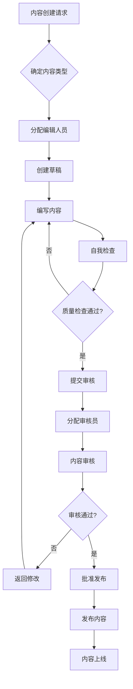

# 15. 内容管理与编辑工作流

## 文档概述

本文档详细规定了力通电子网站的内容管理策略、编辑工作流程、内容质量标准和审核机制。确保内容的专业性、准确性和一致性。

## 内容管理架构

### 内容分类体系

```typescript
// 内容类型定义
export enum ContentType {
  PRODUCT = 'product',
  BRAND = 'brand', 
  ARTICLE = 'article',
  SOLUTION = 'solution',
  NEWS = 'news',
  DOCUMENT = 'document',
  FAQ = 'faq',
  CATEGORY = 'category'
}

// 内容状态管理
export enum ContentStatus {
  DRAFT = 'draft',           // 草稿
  PENDING_REVIEW = 'pending_review',  // 待审核
  IN_REVIEW = 'in_review',   // 审核中
  APPROVED = 'approved',     // 已批准
  PUBLISHED = 'published',   // 已发布
  ARCHIVED = 'archived',     // 已归档
  REJECTED = 'rejected'      // 已拒绝
}

// 内容优先级
export enum ContentPriority {
  HIGH = 'high',     // 高优先级
  MEDIUM = 'medium', // 中优先级
  LOW = 'low'        // 低优先级
}
```

### 用户角色与权限

```typescript
// 用户角色定义
export enum UserRole {
  SUPER_ADMIN = 'super_admin',       // 超级管理员
  CONTENT_MANAGER = 'content_manager', // 内容管理员
  EDITOR = 'editor',                 // 编辑
  TECHNICAL_WRITER = 'technical_writer', // 技术文档编写员
  TRANSLATOR = 'translator',         // 翻译员
  REVIEWER = 'reviewer',             // 审核员
  CONTRIBUTOR = 'contributor'        // 贡献者
}

// 权限矩阵
export const ROLE_PERMISSIONS = {
  [UserRole.SUPER_ADMIN]: {
    create: ['*'],
    read: ['*'],
    update: ['*'],
    delete: ['*'],
    publish: ['*'],
    archive: ['*']
  },
  [UserRole.CONTENT_MANAGER]: {
    create: [ContentType.ARTICLE, ContentType.NEWS, ContentType.FAQ],
    read: ['*'],
    update: [ContentType.ARTICLE, ContentType.NEWS, ContentType.FAQ],
    delete: [ContentType.ARTICLE, ContentType.NEWS, ContentType.FAQ],
    publish: [ContentType.ARTICLE, ContentType.NEWS, ContentType.FAQ],
    archive: [ContentType.ARTICLE, ContentType.NEWS, ContentType.FAQ]
  },
  [UserRole.EDITOR]: {
    create: [ContentType.ARTICLE, ContentType.NEWS],
    read: ['*'],
    update: [ContentType.ARTICLE, ContentType.NEWS],
    delete: [],
    publish: [],
    archive: []
  },
  [UserRole.TECHNICAL_WRITER]: {
    create: [ContentType.SOLUTION, ContentType.DOCUMENT],
    read: ['*'],
    update: [ContentType.SOLUTION, ContentType.DOCUMENT],
    delete: [],
    publish: [],
    archive: []
  }
};
```

## 编辑工作流程

### 内容创建流程



### 审核标准与检查清单

#### 技术内容审核清单
```yaml
技术准确性:
  - [ ] 技术参数和规格正确
  - [ ] 产品型号和编码准确
  - [ ] 电路图和原理图正确
  - [ ] 应用案例可行性验证
  - [ ] 引用资料来源可靠

内容质量:
  - [ ] 文字表达清晰准确
  - [ ] 逻辑结构合理
  - [ ] 图表清晰易读
  - [ ] 格式规范一致
  - [ ] 多语言版本同步

SEO优化:
  - [ ] 关键词使用合理
  - [ ] 标题和描述优化
  - [ ] 内链设置恰当
  - [ ] 图片alt标签完整
  - [ ] URL结构友好

合规性检查:
  - [ ] 符合行业法规要求
  - [ ] 无侵权风险
  - [ ] 隐私政策遵循
  - [ ] 免责声明完整
  - [ ] 认证标识正确
```

## 内容模板与标准

### 产品文档模板

```typescript
// 产品内容模板
export interface ProductContentTemplate {
  // 基础信息
  basicInfo: {
    partNumber: string;
    brandName: string;
    category: string;
    subcategory?: string;
    shortDescription: string; // 50字以内
  };
  
  // 详细描述
  detailedDescription: {
    overview: string;        // 产品概述 100-200字
    features: string[];      // 主要特性 5-10条
    applications: string[];  // 应用场景 3-8条
    advantages: string[];    // 产品优势 3-5条
  };
  
  // 技术规格
  specifications: {
    electricalSpecs: Record<string, string>;  // 电气参数
    mechanicalSpecs: Record<string, string>;  // 机械参数
    environmentalSpecs: Record<string, string>; // 环境参数
    certifications: string[];                 // 认证信息
  };
  
  // 支持文档
  supportDocs: {
    datasheet?: string;      // 规格书URL
    applicationNote?: string; // 应用说明URL
    referenceDesign?: string; // 参考设计URL
    softwareTools?: string[]; // 软件工具
  };
  
  // SEO信息
  seo: {
    title: string;          // SEO标题
    description: string;    // SEO描述
    keywords: string[];     // 关键词
    canonicalUrl?: string;  // 规范URL
  };
}
```

### 技术文章模板

```typescript
// 技术文章内容模板
export interface TechnicalArticleTemplate {
  // 文章元信息
  metadata: {
    title: string;          // 文章标题
    subtitle?: string;      // 副标题
    author: string;         // 作者
    reviewedBy?: string;    // 技术审核人
    publishDate: Date;      // 发布日期
    lastUpdated: Date;      // 最后更新
    readingTime: number;    // 预计阅读时间(分钟)
    difficulty: 'beginner' | 'intermediate' | 'advanced';
  };
  
  // 文章结构
  content: {
    abstract: string;       // 摘要 100-150字
    introduction: string;   // 引言部分
    mainSections: {
      title: string;
      content: string;
      codeExamples?: string[];
      images?: string[];
      relatedProducts?: string[];
    }[];
    conclusion: string;     // 结论部分
    references?: string[];  // 参考文献
  };
  
  // 相关内容
  relations: {
    relatedArticles?: string[];  // 相关文章
    relatedProducts?: string[];  // 相关产品
    relatedSolutions?: string[]; // 相关解决方案
    tags: string[];             // 标签
  };
}
```

## 内容质量管理

### 内容评分系统

```typescript
// 内容质量评分
export interface ContentQualityScore {
  technicalAccuracy: number;    // 技术准确性 (1-10)
  readability: number;          // 可读性 (1-10)
  seoOptimization: number;      // SEO优化度 (1-10)
  visualQuality: number;        // 视觉质量 (1-10)
  userEngagement: number;       // 用户互动度 (1-10)
  overallScore: number;         // 综合评分 (1-10)
  
  // 改进建议
  suggestions: {
    category: 'technical' | 'content' | 'seo' | 'visual' | 'engagement';
    description: string;
    priority: 'high' | 'medium' | 'low';
  }[];
}

// 质量评估函数
export function evaluateContentQuality(content: any): ContentQualityScore {
  // 实现内容质量评估逻辑
  return {
    technicalAccuracy: calculateTechnicalScore(content),
    readability: calculateReadabilityScore(content),
    seoOptimization: calculateSEOScore(content),
    visualQuality: calculateVisualScore(content),
    userEngagement: calculateEngagementScore(content),
    overallScore: 0, // 计算综合评分
    suggestions: []
  };
}
```

### 内容更新策略

```typescript
// 内容更新计划
export interface ContentUpdateStrategy {
  // 定期更新规则
  updateSchedule: {
    productSpecs: 'monthly';        // 产品规格月度更新
    technicalArticles: 'quarterly'; // 技术文章季度审核
    industryNews: 'weekly';         // 行业新闻周度更新
    solutionCases: 'bi-annual';     // 解决方案半年度更新
  };
  
  // 触发更新条件
  updateTriggers: {
    productDiscontinuation: boolean; // 产品停产
    specificationChange: boolean;    // 规格变更
    regulatoryUpdate: boolean;       // 法规更新
    competitorActivity: boolean;     // 竞品活动
    userFeedback: boolean;          // 用户反馈
  };
  
  // 批量更新工具
  batchUpdateTools: {
    priceUpdate: boolean;           // 批量价格更新
    categoryReorganization: boolean; // 分类重组
    multiLanguageSync: boolean;     // 多语言同步
    seoOptimization: boolean;       // SEO批量优化
  };
}
```

## 多语言内容管理

### 翻译工作流

```typescript
// 翻译任务管理
export interface TranslationTask {
  id: string;
  sourceLanguage: string;         // 源语言
  targetLanguages: string[];      // 目标语言
  contentType: ContentType;       // 内容类型
  contentId: string;              // 内容ID
  priority: ContentPriority;      // 优先级
  deadline: Date;                 // 截止日期
  assignedTranslator: string;     // 分配翻译员
  status: TranslationStatus;      // 翻译状态
  qualityScore?: number;          // 翻译质量评分
  
  // 翻译要求
  requirements: {
    technicalTerminology: boolean; // 技术术语要求
    culturalAdaptation: boolean;   // 文化适应要求
    seoOptimization: boolean;      // SEO优化要求
    brandConsistency: boolean;     // 品牌一致性要求
  };
}

export enum TranslationStatus {
  PENDING = 'pending',
  IN_PROGRESS = 'in_progress',
  REVIEW = 'review',
  APPROVED = 'approved',
  PUBLISHED = 'published'
}
```

### 术语管理系统

```typescript
// 技术术语库
export interface TerminologyDatabase {
  terms: {
    [termId: string]: {
      english: string;
      chinese: string;
      japanese: string;
      korean: string;
      german: string;
      french: string;
      spanish: string;
      // ... 其他语言
      
      // 术语属性
      category: 'technical' | 'business' | 'general';
      field: 'semiconductor' | 'electronics' | 'power' | 'analog' | 'digital';
      approved: boolean;
      approvedBy: string;
      approvedDate: Date;
      
      // 使用说明
      usage: {
        context: string;        // 使用场景
        examples: string[];     // 使用示例
        alternatives: string[]; // 替代术语
      };
    };
  };
  
  // 术语验证规则
  validationRules: {
    consistency: boolean;       // 一致性检查
    contextSensitivity: boolean; // 场景敏感性
    brandAlignment: boolean;    // 品牌对齐
  };
}
```

## 内容性能监控

### 内容分析指标

```typescript
// 内容性能指标
export interface ContentAnalytics {
  // 访问指标
  traffic: {
    pageViews: number;          // 页面浏览量
    uniqueVisitors: number;     // 独立访客数
    averageTimeOnPage: number;  // 平均停留时间
    bounceRate: number;         // 跳出率
    sessionDuration: number;    // 会话时长
  };
  
  // 互动指标
  engagement: {
    inquiryRate: number;        // 询价转化率
    downloadRate: number;       // 文档下载率
    shareCount: number;         // 分享次数
    commentCount: number;       // 评论数量
    favoriteCount: number;      // 收藏次数
  };
  
  // SEO指标
  searchPerformance: {
    averagePosition: number;    // 平均排名
    clickThroughRate: number;   // 点击率
    impressions: number;        // 曝光次数
    organicTraffic: number;     // 自然流量
  };
  
  // 转化指标
  conversion: {
    inquiryConversion: number;  // 询价转化
    quoteConversion: number;    // 报价转化
    leadGeneration: number;     // 线索生成
    customerAcquisition: number; // 客户获取
  };
}

// 内容优化建议系统
export function generateContentOptimizationSuggestions(
  analytics: ContentAnalytics
): ContentOptimizationSuggestion[] {
  const suggestions: ContentOptimizationSuggestion[] = [];
  
  // 基于分析数据生成优化建议
  if (analytics.traffic.bounceRate > 0.7) {
    suggestions.push({
      type: 'content_improvement',
      priority: 'high',
      description: '跳出率过高，建议优化页面内容结构和可读性',
      actions: ['改进页面布局', '增加相关内容推荐', '优化加载速度']
    });
  }
  
  if (analytics.engagement.inquiryRate < 0.02) {
    suggestions.push({
      type: 'cta_optimization',
      priority: 'medium',
      description: '询价转化率偏低，建议优化行动召唤设计',
      actions: ['调整CTA按钮位置', '优化询价表单', '添加信任元素']
    });
  }
  
  return suggestions;
}

export interface ContentOptimizationSuggestion {
  type: 'content_improvement' | 'seo_optimization' | 'cta_optimization' | 'technical_update';
  priority: 'high' | 'medium' | 'low';
  description: string;
  actions: string[];
}
```

## 内容归档与版本控制

### 版本管理系统

```typescript
// 内容版本管理
export interface ContentVersion {
  id: string;
  contentId: string;
  version: string;              // 版本号 (语义化版本)
  author: string;               // 作者
  timestamp: Date;              // 创建时间
  changeLog: string;            // 变更日志
  status: ContentStatus;        // 版本状态
  
  // 变更类型
  changeType: 'major' | 'minor' | 'patch';
  changes: {
    field: string;              // 变更字段
    oldValue: any;              // 旧值
    newValue: any;              // 新值
    reason: string;             // 变更原因
  }[];
  
  // 版本关系
  parentVersion?: string;       // 父版本
  childVersions?: string[];     // 子版本
  
  // 发布信息
  publishInfo?: {
    publishedAt: Date;
    publishedBy: string;
    publishChannel: string[];   // 发布渠道
  };
}
```

## 实施时间线

### 第一阶段：基础设施搭建 (2周)
- [ ] Sanity Studio自定义配置
- [ ] 用户角色权限系统
- [ ] 基础工作流程配置
- [ ] 内容模板创建

### 第二阶段：工作流程实施 (3周)  
- [ ] 审核流程自动化
- [ ] 质量评分系统
- [ ] 多语言翻译工具集成
- [ ] 版本控制系统

### 第三阶段：分析与优化 (2周)
- [ ] 内容分析仪表板
- [ ] 性能监控系统
- [ ] 优化建议引擎
- [ ] 报告和导出功能

### 第四阶段：培训与上线 (1周)
- [ ] 团队培训材料
- [ ] 操作手册编写
- [ ] 系统测试验收
- [ ] 正式上线运行

---

**文档版本**: v1.0  
**创建日期**: 2025-09-06  
**适用范围**: 力通电子网站内容管理团队